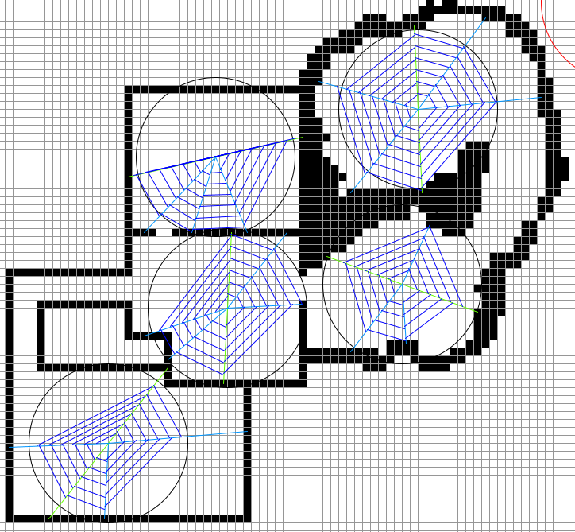

# Spider Web Generation
 Spider web generation in processing programming lanugage. 
 Not to be confused with the [interwebs/internet](https://en.wikipedia.org/wiki/Internet).

#### How to use:
- left click: palce wall
- right click: remove wall
- center click: place web

#### To succsessfully generate webs:
- make sure there is a big free space(a bit smaller than the circle)
- make sure your place of spawning is far enough away from existing webs and largely enclosed by walls